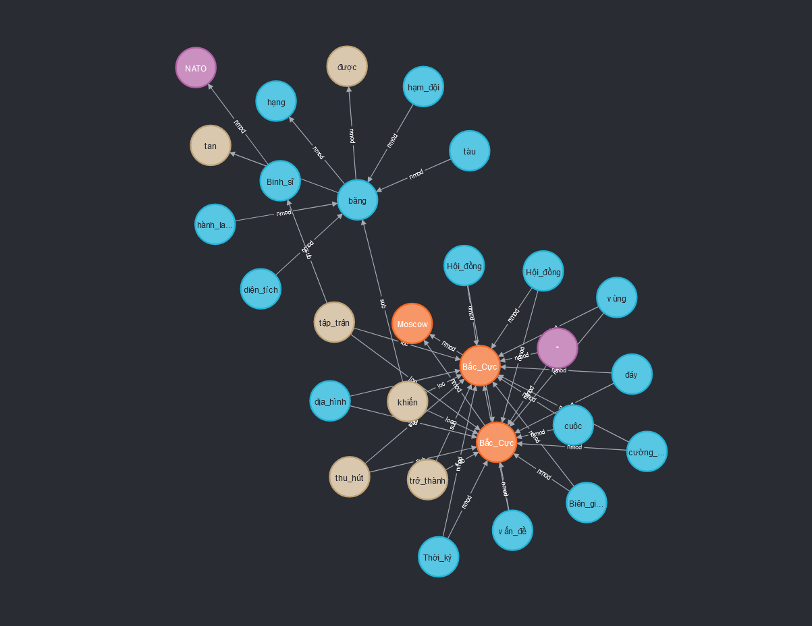

# Neo4j-dependency-parsing
## Visualization of dependency parsing for Vietnamese with VnCoreNLP and Neo4j


1. Import Documents to Neo4j DB API:  http://0.0.0.0:9664/docs#
2. Neo4j Browser: http://0.0.0.0:7474/browser/



## Node and Relationship import data schemas:
```json
Node (word):
{
    "data":[
        {
            "wordForm": wordForm,
            "nerLabel": nerLabel,
            "label": posTag
        }
    ]
}


Relationship (dependency):
{
    "data":[
        {
            "start_word": start_wordForm,
            "start_posTag": start_posTag,
            "end_word": end_wordForm,
            "end_posTag": end_posTag,
            "label": depLabel,
            "doc_id": doc_id,
            "sentence_id": sentence_id
        }
    ]
}
```

## Installation and configuration

### Create and start Neo4j Docker container
```shell
sudo create_docker_container.sh
```

### Create python venv
```shell
python3.8 -m venv venv
```
```shell
source venv/bin/activate
```
```shell
pip install -r requirements.txt
```

### Start import data service
```shell
bash run_import_data_service.sh
```